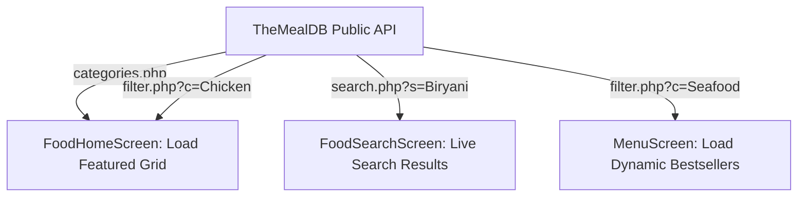

# Multi-Service App Implementation Plan: Expert Mode Live API Integration

This plan proposes the integration of public APIs to transition the **Food Delivery Flow** from a static mock screen system into a fully dynamic, live-fetching expert application.

---

## 🌐 Selected API: **TheMealDB API**

We will utilize **TheMealDB API** due to its rich food database, free public accessibility (no API keys required for development), lightning-fast responses, and high-quality dish imagery.

### Dynamic Data Mapping

---

## 📂 Proposed Changes

### 1. [MODIFY] [RestaurantListScreen.js](file:///home/azad/Projects/Blue-tomato/frontend/src/screens/Food/RestaurantListScreen.js)
*   **Live Categories:** On mount, perform an API request to `https://www.themealdb.com/api/json/v1/1/categories.php` to fetch authentic categories (Beef, Chicken, Seafood, Vegan) with thumbnails instead of static lists.
*   **Dynamic Featured Grid:** Fetch featured dishes from the active selected category to populate the featured grid (starting at ₹96.00 with dynamic titles, and thumbnail images).
*   **Loader States:** Implement elegant loading spinners (`ActivityIndicator`) and fade transitions so network requests feel native and premium.

### 2. [MODIFY] [FoodSearchScreen.js](file:///home/azad/Projects/Blue-tomato/frontend/src/screens/Food/FoodSearchScreen.js)
*   **Dynamic Live Search:** Connect the search text input to a debounced API query to `https://www.themealdb.com/api/json/v1/1/search.php?s={query}`.
*   **Real-time Results:** Render real results from the query, displaying actual thumbnails overlapping the Zomato ribbons, exact names, and ratings, while preserving full quantity `- 1 +` counter interactions.

### 3. [MODIFY] [MenuScreen.js](file:///home/azad/Projects/Blue-tomato/frontend/src/screens/Food/MenuScreen.js)
*   **Custom Menu Items:** Dynamically retrieve recommended menu items for the restaurant using `https://www.themealdb.com/api/json/v1/1/filter.php?c=Dessert` (or selected cuisine categories) to construct a realistic 100% active food card menu listing.

---

## 🔬 Verification Plan

1.  **Network Robustness:** Check gracefully handling of slow internet or empty search results (displaying "No dishes found, try searching 'Pizza' or 'Cake'").
2.  **State Conservation:** Verify that when a user adds/subtracts quantities on dynamically loaded items, local cart tallies remain perfectly accurate and stable.
3.  **UI Seamlessness:** Ensure loaders look gorgeous and match the visual aesthetics of Swiggy and Zomato.
